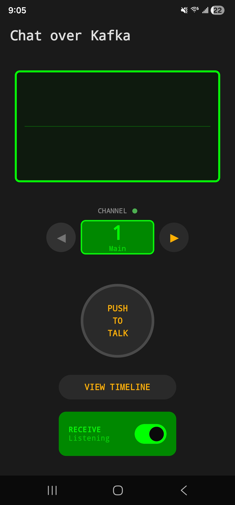
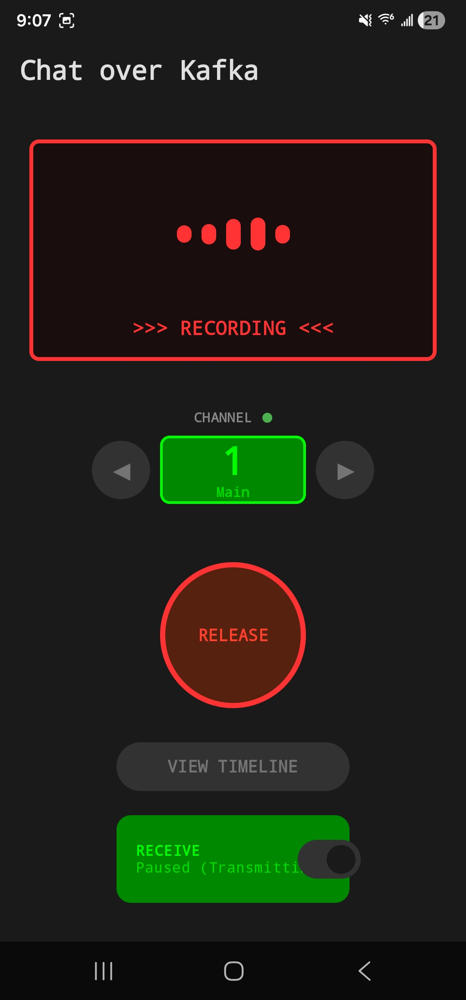
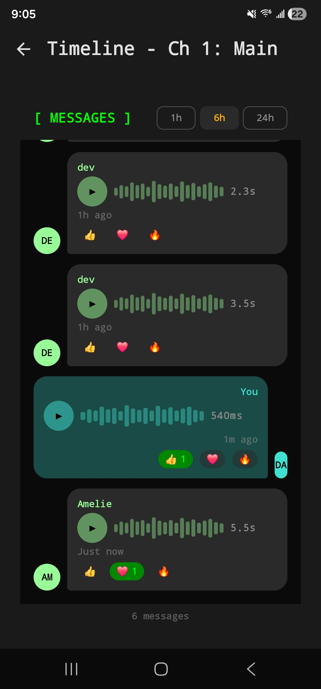

# Chat over Kafka

This project is a human-scale walkie-talkie app for Android, meant for a family or a small group of friends.

You only need a (free) Kafka cluster to run your own instance — no servers, no backend services — just Kafka
(see [installation](#installation)).

<table>
  <tr>
    <td align="center">
      
    </td>
    <td align="center">
      
    </td>
    <td align="center">
      
    </td>
  </tr>
</table>
## Demo

```
[ Demo video placeholder ]
```

## What the app does

Chat over Kafka behaves like a traditional walkie‑talkie:
- Hold the button to broadcast, release to send.
- Anyone tuned to the same channel hears the message.
- You can replay past recordings from the timeline.
- You can add reactions to past messages.


## What does it have to do with Kafka?

Kafka is the sole backend for the application. There are no other servers, relays, or real-time gateways.
The app relies on Kafka for:
- one-to-many broadcast
- message history
- message reactions via compacted topics

## Why build this?

This started as an exploratory project to see how far you could go using Kafka alone as an application backend.
The choice of Kafka was inspired by the Aiven competition to leverage their recent free kafka offering.

## How it works?

The app uses a direct connection to Kafka:

- **Audio encoding**: Opus codec wrapped with JNI ([see audio processing docs](docs/AUDIO_PROCESSING.md))
- **Kafka client**: librdkafka wrapped with JNI ([see kafka on android](docs/KAFKA_ON_ANDROID.md))
- **Authentication**: Per-user mTLS certificates from Aiven
- **Topics**: Separate audio and metadata topics per channel ([see kafka topic layout](docs/KAFKA_TOPICS.md))

```
+----------------+          +----------------+
|   Device A     |          |   Device B     |
|  (Producer)    |          |  (Consumer)    |
+-------+--------+          +--------+-------+
        |                            ^
        | Opus-encoded audio         |
        v                            |
+-------+----------------------------+-------+
|              Kafka Cluster                 |
|    (mTLS authenticated, Aiven hosted)      |
+--------------------------------------------+
```

## Run your own channels and connect your Android devices


### Prerequisites

- An [Aiven](https://aiven.io) account (no credit card needed)
- Python 3 with `qrcode` and `pillow` modules (`pip install qrcode pillow`)
- Terraform
- jq, curl (for calling the Aiven API)

### Installation

Installation is handled by the provision.sh script. It uses Terraform to provision a Kafka cluster and create the required topics.

Once the cluster is ready, the script can generate per-user mTLS certificates, build an APK bundled with those certificates and a username, and generate a QR code for installing the APK over the local network.

Note: your build machine and the Android device must be on the same local network to use the QR code installer.


1. Set up a Kafka cluster (skip if you already have one).
  Get your Aiven API token from https://console.aiven.io/profile/tokens

Add the token to `terraform.tfvars`

Choose a geographically close cloud region (e.g. do-sfo) and configure it in `terraform.tfvars`
 (see available regions [here](https://aiven.io/docs/platform/reference/list_of_clouds#digitalocean))

`terraform.tfvars` should look like so
```
aiven_api_token = "<<YOUR TOKEN HERE>>"
aiven_cloud_region = "do-sfo"
```

2. **Initialize infrastructure and create a user**
   ```bash
   cd provisioning
   ./provision.sh init #skip if you already have a cluster
   ./provision.sh add-user alice #this generates a certificate and builds an APK for the user

   ```

3. **Install on your device**

(if you don't have an android device, skip this part and use the emulator on linux/macos)
   ```bash
   ./provision.sh serve
   ```
   Scan the QR code on your Android device to download the APK.

4. Android may show various warnings because we are installing the APK directly from a link. The APK is built locally so you can just look at the code and decide for yourself if you trust what it's doing.

### Provisioning script

| Command | Description |
|---------|-------------|
| `./provision.sh init` | Initialize Terraform infrastructure |
| `./provision.sh add-user <name>` | Create a new user with unique certificates and build APK |
| `./provision.sh get-bundle <name>` | Get QR code/download link for existing user |
| `./provision.sh list-users` | List all provisioned users |
| `./provision.sh serve` | Start HTTP server for APK downloads |

### Tooling note

Parts of this project were developed with the help of Anthropic’s Claude Code.

## License

MIT