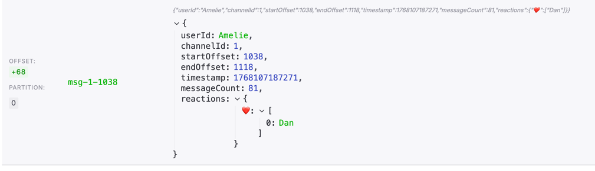

## Kafka topics

The application uses 2 kafa partition for each channel:
- 1 partition on an audio topic contains the encoded audio (audio is chunked into several messages)

- 1 partition on a metadata topic (log compacted)
Metadata messages look like so:

Note the message key that allows for updates (reactions) to be tracked.)